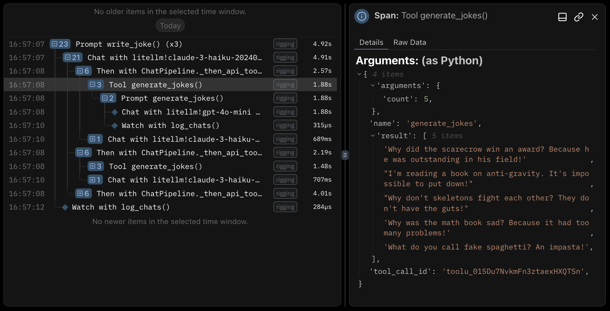

Rigging integrates with the [Logfire](https://logfire.pydantic.dev/docs/) library for exposing tracing information about execution. Specifically we use the logfire-API no-op package, making it optional for users with no overhead if you don't need it.

Logfire is capable of reporting trace information to any Open Telemetry compatible system, and provides convenient abstractions on top of the standard open-telemetry-SDK. If the `logfire` package is installed and configured, details about pipelines, prompts, and tools will be traced when you use rigging.

You can configure Logfire to use [alternative backends](https://logfire.pydantic.dev/docs/how-to-guides/alternative-backends/) as needed to integrate with your preferred tracing stack.

```python
import rigging as rg
import logfire

logfire.configure()

@rg.prompt(generator_id="gpt-4o")
async def summarize(content: str) -> str:
    """
    Summarize the content into 1-2 sentences then save it
    """

summarize.watch(rg.watchers.write_chats_to_jsonl("chats.jsonl"))

text = """
Revachol is located on the island of Le Caillou, also called "The Pebble" on the northeast side of the
Insulindian Isola, on the world's largest body of water: the Insulindic. The city itself has a radius
of 80 kilometres and is split by the River Esperance into Revachol East and Revachol West. The north
side of the island is shattered by the delta of the Esperance, and is named La Delta.
"""

await summarize.run_many(3, text)

# 23:46:31.484 Prompt summarize() (x3)
# 23:46:31.485   Chat with litellm!gpt-4o (x3)
# 23:46:32.874   Watch with rigging.watchers.write_chats_to_jsonl()
```

<Note>
Rigging will attach call parameters and results for both tools and prompt functions, as well as finalized chat objects at the end of a pipeline. Logfire will serialize these items as JSON values inside attributes, and include a dynamic JSON schema for reference. When using their platform, these items deserialize directly into the web view.
</Note>



## Inference Tracing

We've opted to exclude tracing at the generator level in Rigging (for now) and focus on instrumenting higher-order abstractions like pipelines and tools, which are specific to the framework.

There are a suite of powerful instrumentation libraries (including Logfire) which will add tracing to underlying libraries like LiteLLM (recommended), OpenAI, Anthropic, VertexAI, and others. These snap right into the tracing spans from rigging, and provide insight into the raw inference traffic before it's sent to API endpoints and inference libraries.

- [LiteLLM - Logfire](https://docs.litellm.ai/docs/observability/logfire_integration)
- [LiteLLM - OpenTelemetry](https://docs.litellm.ai/docs/observability/opentelemetry_integration)
- [Logfire - Integrations](https://logfire.pydantic.dev/docs/integrations/)
- [TraceLoop - openllmetry](https://github.com/traceloop/openllmetry)

Here is an example of adding LiteLLM tracing on top of rigging:

```python
import rigging as rg
import logfire
import litellm

logfire.configure()

os.environ.setdefault("LOGFIRE_TOKEN", "") # (1)!
litellm.callbacks = ["logfire"]

# ...
```

*1. As of publication, LiteLLM requires this environment variable, even if it's empty and Logfire is managing tokens for you.*
